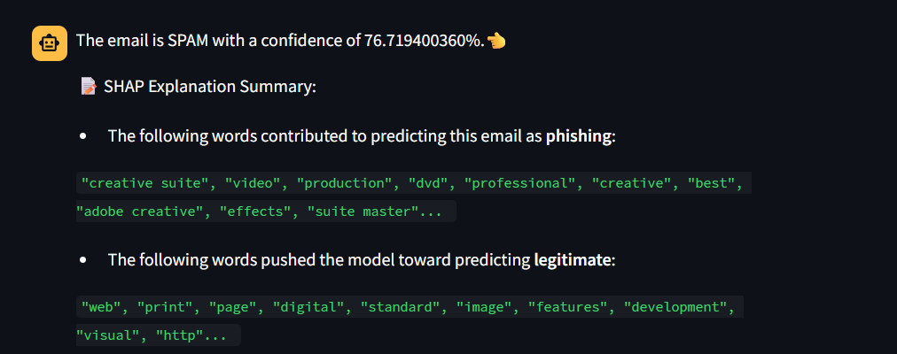

# Security Analysis and Suggestions on UVIC Spam Detector

## Abstract
 UVic Spam Detector is a publicly accessible web application that lets users submit email text and select from multiple machine‑learning classifiers to determine if a message is spam or legitimate. This report analyzes both the web application surface and the underlying models, identifying vulnerabilities, rating their criticality, and recommending concrete mitigations.

## Introduction

### Background  
UVic Spam Detector is a lightweight, publicly accessible web-based application that allows anyone to submit raw email content to receive a “spam” or “not spam” verdict, using one of four models: Logistic Regression, Naive Bayes, Support Vector Machine (SVM), or Random Forest. The site exposes a simple upload form and JSON API for inference but lacks HTTPS, authentication, and access controls—making every endpoint vulnerable to public and automated abuse. Internally, uploaded emails are tokenized and vectorized before being classified by models such as Naive Bayes, Random Forest, or a small neural network.

### Objectives  
Based on the usage and design of this web application, we will focus on confidentiality, integrity, and availability, the three pillars of cyber security. Each vulnerability will be discussed based on the nature of this tool to see if it poses a threat to the application. We will also discuss criticality (impact + likelihood) of these vulnerabilities and how they can be exploit in practice.

### Methodology
Our approach combines traditional web‑app testing and ML‑specific threat modeling. (mostly static?)
This structured methodology ensures comprehensive coverage of both classic web vulnerabilities and emerging risks in machine‑learning‑driven applications.

## System Overview
### Architecture Diagram  
(data inputs, processing pipeline, classification engine, user interface, storage).  

### Key Technologies & Dependencies  
Machine Learning Models including: Logistic Regression, Naive Bayes, SVM, and Random Forest; Develped on Jupter Notebook using Python, Depolyed using AWS.  
### Data Flow  
A user (no login required) pastes raw email text into the web form, after which the application normalizes it (e.g., strips punctuation and tokenizes words) and vectorizes the tokens with the pre‑built Bag‑of‑Words / TF‑IDF model for the selected classifier (Logistic Regression, Naive Bayes, SVM, or Random Forest). The chosen static model then produces a spam / ham (non‑spam) label and currently a confidence score plus indicative tokens for explanation, which is returned in the response. The email content provided by users is neither stored or used in retraining, but processed only in memory for the current classification and then discarded.

## Security Analysis

Website

Possible injection? 

As the application does not request user to log in, and they are most likely spam emails, we do not consider privacy as a pressing issue in this report. We would recommand to add an notification to alert user that they should not be pasting anything sensitive or personal information on to the website. But for now, we rely solely on the effort of users to not share personal information with use to avoid any man-in-the-middle attack. 
(This was put into future work as it's specified towards privacy, which is not really our concern in this application)
  

### Machine Learning Model Information Disclosure & Feedback Risk

While the UI currently discloses the specific classifier family (e.g., Logistic Regression) and the top contributing words plus a numeric confidence score [Figure 2], the primary enabling factor for attack is the public endpoint access without rate limitation. Our effort to provide transparency, such as showing users why a message was labeled spam or ham (legitimate, non‑spam email), does improve trust and can educate users. However, the same explanations given (exact model name, precise confidence percentage, and ranked contributing tokens) provides attackers with rich feedback. By iteratively submitting modified emails and observing how individual token changes shift contribution rankings or changes the confidence score, an adversary can rapidly:

1. Learn which “spam” tokens have the highest positive weights.
2. Inject “ham” tokens or benign filler phrases to dilute those weights.
3. Obfuscate high‑impact spam tokens (e.g., spacing) and confirm success via rising confidence.
4. Approximate the model’s decision boundary (model extraction) with far fewer queries than if only a binary label were returned.

To conclude, unlimited queries reduce the time to achieve reliable evasion from potentially thousands of probes (label‑only) to tens or low hundreds (rich explanations), significantly increasing the likelihood of successful large‑scale spam evasion. It's important to find the balance between transparency and security in this case.

### Mitigations & Transparency Trade‑Off

We propose the following three mitigations that most effectively achieve a trade‑off between security and transparency.

**Rate Limiting & Monitoring**

For each IP address, implement request quotas (e.g., limit requests per 5 minutes to 30) and log anomalies such as unusually high volume from the same IP address. Consider temporarily blocking an IP if abnormal usage is repeatedly found in the logs. This directly cuts an attacker’s attempts and slows the process of crafting evasions while having minimal effect on normal users, whose request volume should remain below the limits.

**Output Minimization**

Instead of the current numeric confidence score, return only a coarse confidence bucket (e.g., High, Medium, Low). This removes fine‑grained signals attackers can analyze to fine‑tune their spam recipes, yet still provides legitimate users a reasonable sense of certainty and transparency.

**Feature Attribution Throttling**

Return only a small set of category or indicative terms (e.g., “urgent call‑to‑action,” “financial request,” “ambiguous origin”) to show why a message was classified as spam or non‑spam. These descriptors still give users useful explanation, although some detail is lost. At the same time, this greatly hinders attackers from reverse‑engineering exact feature weights across models for evasion. The full ranked token list currently shown can be moved to internal logs only.

These mitigation methods, tuned based on real‑world usage data, provide a good balance of security and transparency, helping ensure the web‑based application remains effective and resilient over the long term.

## Conclusion
- **Summary of Risks & Benefits**  
  Reiterate the top two or three issues and how your recommendations mitigate them.  
- **Next Steps**  
  Roadmap for implementing fixes, timelines, and responsible teams.  
- **Future Work**  
  As the application does not request user to log in, and they are most likely spam emails, we do not consider privacy as a pressing issue in this report. We would recommand to add an notification to alert user that they should not be pasting anything sensitive or personal information on to the website. But for now, we rely solely on the effort of users to not share personal information with use to avoid any man-in-the-middle attack. 
Exploring differential privacy, federated learning, periodic red‑team exercises.
